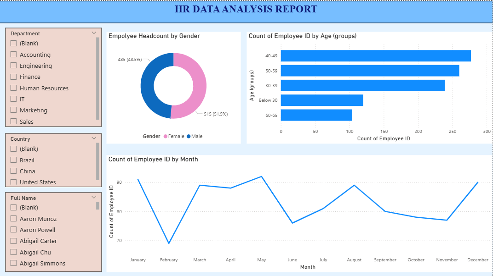
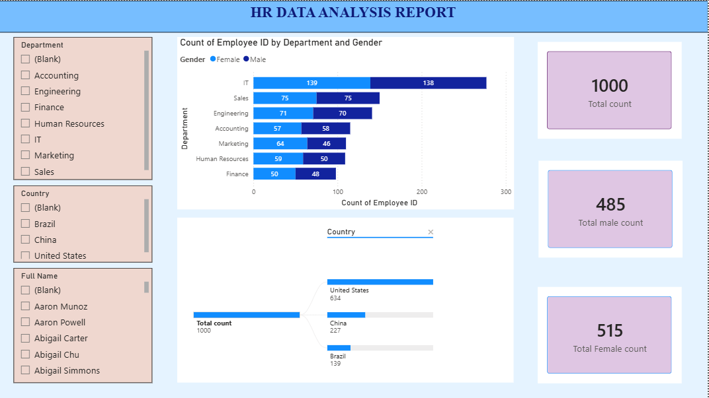

HR Data Analysis Dashboard 📊

📌 Project Overview

This project focuses on analyzing HR data to extract meaningful insights related to employee distribution, demographics, and departmental structure using Power BI.

The dashboard provides a clear visualization of employee data, helping organizations understand workforce trends and make data-driven decisions.

## 📸 Dashboard Preview

🎯 Objectives

- Analyze employee distribution by gender, age, and department
- Identify workforce trends across different countries
- Track monthly employee count patterns
- Provide an interactive and user-friendly dashboard

🛠️ Tools & Technologies Used

- Power BI
- Data Visualization
- Data Cleaning & Transformation

📊 Key Insights

- Total Employees: 1000
- Female Employees: 515 (51.5%)
- Male Employees: 485 (48.5%)
- Majority employees belong to the 40–49 age group
- Highest employee count is in the IT department
- United States has the highest number of employees

📈 Dashboard Features

- Interactive filters (Department, Country, Employee Name)
- Gender distribution visualization
- Age group analysis
- Monthly employee trends
- Department-wise employee comparison

🚀 Conclusion

The dashboard effectively highlights workforce distribution and trends. It helps HR teams make better strategic decisions regarding hiring, resource allocation, and workforce planning.

🔮 Future Scope

- Integration with real-time HR data
- Predictive analysis for employee attrition
- Performance-based insights
- Advanced filtering and drill-down feature

🙌 Acknowledgement

This project was developed as part of my internship to enhance my data analysis and visualization skills using Power BI.
